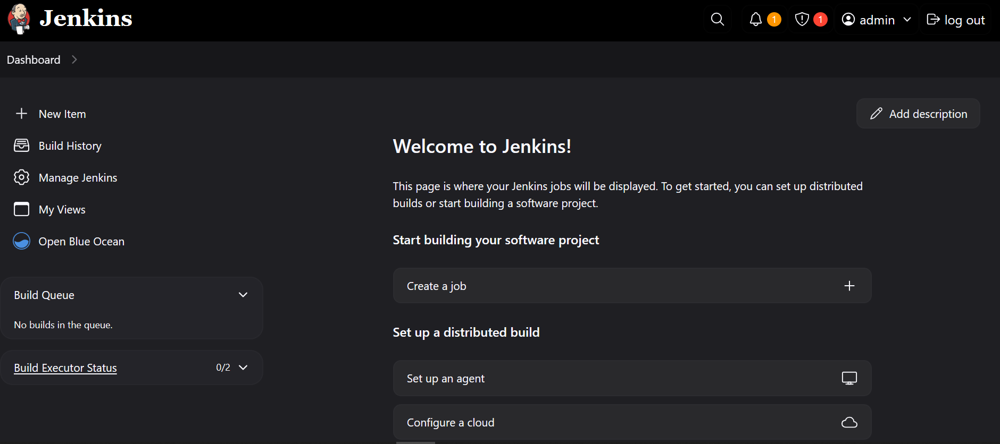
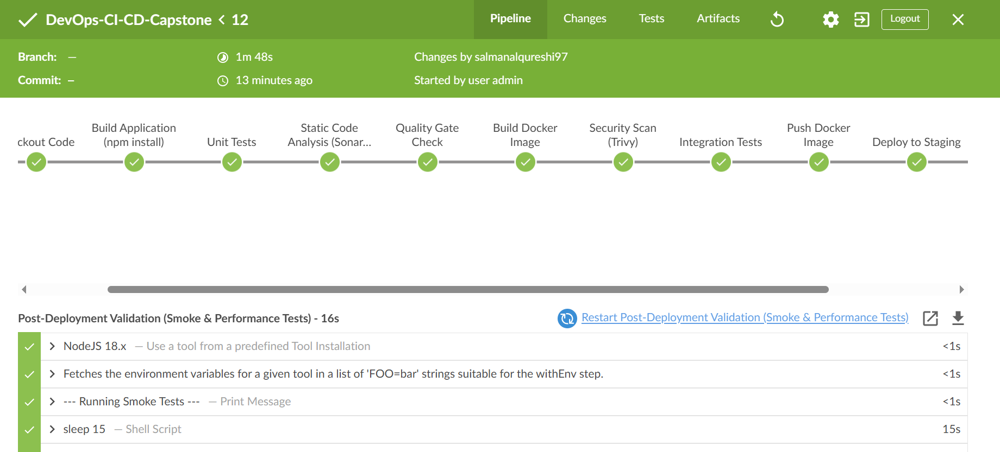
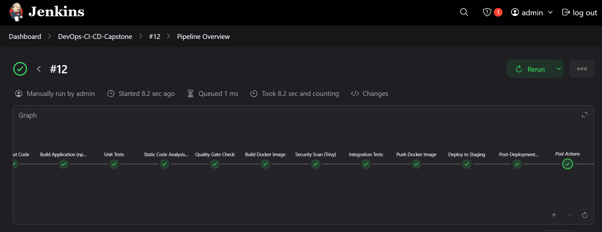
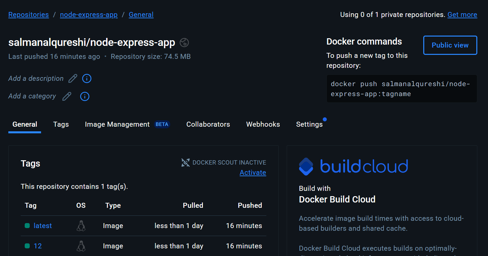
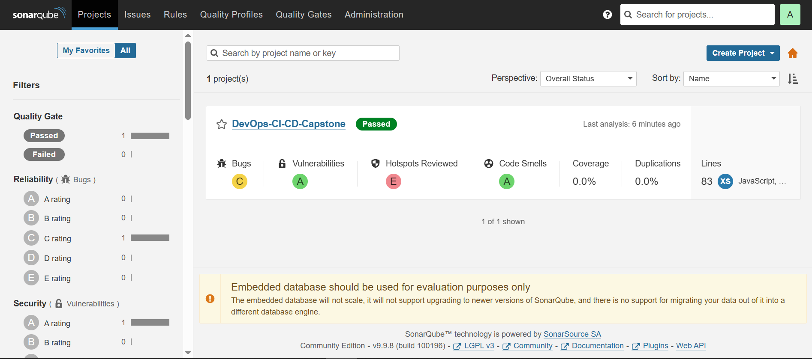
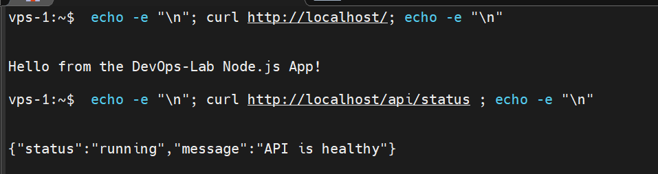

# DevOps CI/CD Capstone: Automating Node.js Deployment with Jenkins + Docker + SonarQube


## 📑 Table of Contents

- [Project Overview](#project-overview-building-a-robust-cicd-pipeline)
- [Technologies Used](#technologies-i-used)
- [Project Structure](#project-structure)
- [Setup Guide](#the-journey-setting-up-my-cicd-pipeline)
- [Jenkins Pipeline](#step-6-crafting-the-jenkins-pipeline-jenkinsfile)
- [Deployment Script](#step-7-the-deployment-script-deploysh)
- [Pipeline Execution](#step-8-orchestrating-the-magic-creating-the-jenkins-pipeline-job)
- [Conclusion](#conclusion-a-fully-automated-cicd-pipeline)


## Project Overview: Building a Robust CI/CD Pipeline

Hello! I'm excited to share a major project where **I designed and implemented a comprehensive Continuous Integration/Continuous Delivery (CI/CD) pipeline** for a simple Node.js Express application. My goal was to fully automate the software delivery lifecycle, from code commit to deployment, using industry-standard DevOps tools.

This project was a hands-on journey where I tackled every stage of a modern CI/CD workflow: building, testing, code quality analysis, security scanning, and automated deployment. I built this entire setup from scratch on a Google Cloud Platform (GCP) Virtual Machine, acting as my dedicated Jenkins server.

**What I achieved:**

* **Automated Builds:** Every code change triggers an automatic build.
* **Comprehensive Testing:** Integrated unit and integration tests running in isolated Docker containers.
* **Code Quality & Security:** Implemented static code analysis with SonarQube and vulnerability scanning of Docker images with Trivy.
* **Containerization:** Packaged the application into Docker images, making it portable and consistent across environments.
* **Automated Deployment:** Set up an automatic deployment process to a staging environment.
* **Post-Deployment Validation:** Included smoke and performance tests to ensure the deployed application's health.

This README will walk you through the architecture, the tools I used, the steps I took to build this pipeline, and even some of the interesting challenges I overcame along the way.

## Technologies I Used

To bring this CI/CD pipeline to life, I leveraged a powerful stack of DevOps tools:

* **Jenkins:** My primary automation server, orchestrating the entire pipeline.
* **Docker:** For containerizing the Node.js application and creating isolated environments for testing.
* **Docker Compose:** To define and run multi-container Docker applications, especially for setting up testing environments.
* **Node.js & npm:** The runtime and package manager for the application itself.
* **Git & GitHub:** For version control and hosting the project repository, triggering pipeline builds.
* **SonarQube:** An open-source platform for continuous inspection of code quality, performing static code analysis.
* **Trivy:** A comprehensive and easy-to-use vulnerability scanner for container images.
* **Google Cloud Platform (GCP):** My chosen cloud provider for hosting the Jenkins VM.
* **Ubuntu Server:** The operating system running on my Jenkins VM.

## Project Structure

Here's a detailed look at how my project repository is organized. This structure facilitates clear separation of concerns and allows the Jenkins pipeline to easily navigate and utilize various components like Dockerfiles, test scripts, and deployment logic.

```
.
|-- Dockerfile
|-- Dockerfile.test
|-- Jenkinsfile
|-- app.js
|-- deploy.sh
|-- docker-compose.test.yml
|-- docker-compose.yml
|-- nginx.conf
|-- package.json
`-- tests
    |-- integration
    |   `-- app.integration.test.js
    `-- unit
        `-- app.test.js
```

### Screenshots of the Pipeline in Action

Throughout this project, I captured various screenshots to visually demonstrate the pipeline's execution and the results from different tools. These images provide a quick overview of the Jenkins dashboard, the Blue Ocean view, SonarQube analysis, and the deployed application

----
#### Jenkins Dashboard Overview


---

#### Jenkins Pipeline Run in Blue Ocean


---

#### Detailed Pipeline Stages View


---

#### Docker Hub Image Repository


---

#### SonarQube Dashboard Analysis


---

#### Deployed Application (Curl Output)


---

-----
## The Journey: Setting Up My CI/CD Pipeline

This section details the step-by-step process I followed to build and configure my CI/CD pipeline, including the initial setup of the Jenkins environment and the specific configurations within Jenkins itself. I'll also highlight some of the key challenges I faced and how I overcame them.

### Step 1: Setting Up the Environment on GCP

My first task was to provision a virtual machine on Google Cloud Platform (GCP) to host my Jenkins server and Docker daemon.

1.  **I launched a new Ubuntu 22.04 LTS VM instance** on GCP. I made sure to configure the firewall rules to allow incoming traffic on ports `22` (for SSH), `80` (for web applications), `8080` (for Jenkins), `9000` (for SonarQube), and `9001` (for SonarQube's secondary port).
2.  **I connected to my VM via SSH.**

### Step 2: Installing Docker and Docker Compose

Docker was fundamental for containerizing my application and creating isolated test environments, as well as running SonarQube itself.

1.  **I updated my package list and installed necessary dependencies:**
    ```bash
    sudo apt update
    sudo apt install -y apt-transport-https ca-certificates curl software-properties-common
    ```
2.  **I added Docker's official GPG key:**
    ```bash
    curl -fsSL https://download.docker.com/linux/ubuntu/gpg | sudo gpg --dearmor -o /usr/share/keyrings/docker-archive-keyring.gpg
    ```
3.  **I added the Docker repository:**
    ```bash
    echo "deb [arch=$(dpkg --print-architecture) signed-by=/usr/share/keyrings/docker-archive-keyring.gpg] https://download.docker.com/linux/ubuntu $(lsb_release -cs) stable" | sudo tee /etc/apt/sources.list.d/docker.list > /dev/null
    ```
4.  **I installed Docker Engine, containerd, and Docker Compose Plugin:**
    ```bash
    sudo apt update
    sudo apt install -y docker-ce docker-ce-cli containerd.io docker-compose-plugin
    ```
    *Self-correction Moment (Mistake 1):* Initially, I encountered an error where `docker-compose` was "not found" in my Jenkins pipeline later on. I realized that the modern Docker installation now provides `docker compose` (two words) via `docker-compose-plugin`, rather than the standalone `docker-compose` command (one word). Although the pipeline initially called `docker-compose` (one word), installing `docker-compose-plugin` typically sets up a compatibility layer or allows for the direct use of `docker compose` within scripts. My fix involved ensuring `docker-compose-plugin` was correctly installed and accessible.

5.  **I added my `vps-1` user to the `docker` group to manage Docker without `sudo`:**
    ```bash
    sudo usermod -aG docker ${USER} # For my current vps-1 user
    newgrp docker # To apply group changes immediately for the current session
    ```
6.  **I verified Docker installation:**
    ```bash
    docker run hello-world
    docker compose version
    ```

### Step 3: Installing Jenkins

Jenkins would be the heart of my automation.

1.  **I installed Java Development Kit (JDK) 17, which is required by Jenkins:**
    ```bash
    sudo apt update
    sudo apt install -y openjdk-17-jdk
    ```
2.  **I added Jenkins' GPG key and repository:**
    ```bash
    curl -fsSL https://pkg.jenkins.io/debian-stable/jenkins.io-2023.key | sudo tee /usr/share/keyrings/jenkins-keyring.asc > /dev/null
    echo deb [signed-by=/usr/share/keyrings/jenkins-keyring.asc] https://pkg.jenkins.io/debian-stable binary/ | sudo tee /etc/apt/sources.list.d/jenkins.list > /dev/null
    ```
3.  **I updated `apt` and installed Jenkins:**
    ```bash
    sudo apt update
    sudo apt install -y jenkins
    ```
4.  **I started and enabled the Jenkins service:**
    ```bash
    sudo systemctl start jenkins
    sudo systemctl enable jenkins
    sudo systemctl status jenkins
    ```
5.  **I waited a few moments for Jenkins to start, then accessed it in my browser** using `http://YOUR_VM_EXTERNAL_IP:8080`.
6.  **I unlocked Jenkins** using the initial admin password found at `/var/lib/jenkins/secrets/initialAdminPassword`.
7.  **I installed suggested plugins** during the initial setup.

### Step 4: Configuring Jenkins for CI/CD

This was a critical phase where I equipped Jenkins with the necessary tools and credentials to interact with my project's ecosystem.

1.  **Installing Essential Plugins:**
    After logging into Jenkins, I navigated to `Manage Jenkins` -> `Plugins` -> `Available plugins` and installed the following:
    * **Git:** For SCM integration.
    * **Docker:** To allow Jenkins to build and run Docker images.
    * **NodeJS Plugin:** To manage Node.js installations for `npm install`.
    * **SonarQube Scanner for Jenkins:** To integrate with my SonarQube server for code analysis.
    * **Pipeline:** (Usually installed by default, but essential for declarative pipelines).
    * **SSH Agent (if needed for SSH deployments to separate VMs later):** Though not strictly used in this pipeline, I kept it in mind for future expansions.

2.  **Global Tool Configuration:**
    I went to `Manage Jenkins` -> `Tools` and configured the following:
    * **NodeJS:** I added a NodeJS installation, named it `NodeJS 18.x`, and set it to install automatically. This ensured my `npm install` steps had the correct environment.
    * **SonarQube Scanner:** I added a SonarQube Scanner installation, named it `SonarScanner`, and set it to install automatically. This tool would execute the static code analysis.

3.  **Adding Credentials:**
    Securely managing access to Docker Hub and SonarQube was crucial. I navigated to `Manage Jenkins` -> `Manage Credentials` -> `Jenkins` -> `Global credentials (unrestricted)` and added:
    * **Docker Hub Credentials:**
        * **Kind:** Username with password
        * **Scope:** Global
        * **Username:** My Docker Hub username (`salmanalqureshi`)
        * **Password:** My Docker Hub password
        * **ID:** `docker-hub-credentials` (This ID is referenced in the `Jenkinsfile` for pushing images).
    * **SonarQube Token:**
        * **Kind:** Secret text
        * **Scope:** Global
        * **Secret:** My SonarQube user token (generated from my SonarQube profile)
        * **ID:** `sonarqube-token` (This ID is referenced in the `Jenkinsfile`).

4.  **Configuring SonarQube Server in Jenkins:**
    I went to `Manage Jenkins` -> `Configure System` and scrolled down to the "SonarQube servers" section.
    * **Name:** `SonarQube` (This name is referenced by `SONARQUBE_SERVER_NAME` in my `Jenkinsfile`).
    * **Server URL:** `http://localhost:9000`
        * *Self-correction Moment (Mistake 4):* I initially faced an error `Expected URL scheme 'http' or 'https' but no scheme was found for /api/c...` during the Quality Gate Check. I realized I might have forgotten the `http://` prefix in the "Server URL" field, or it was stripped upon saving. Re-entering it explicitly as `http://localhost:9000` fixed this.
    * **Authentication Token:** Selected `sonarqube-token` from the dropdown.

-----

### Step 5: Setting Up SonarQube (The Code Quality Guardian)

With Jenkins up and running, my next move was to integrate SonarQube for static code analysis and quality gates. I chose to run SonarQube as a Docker container, making its setup straightforward on my Jenkins VM.

1.  **I pulled the SonarQube LTS Community Docker image:**
    ```bash
    docker pull sonarqube:lts-community
    ```
2.  **I created a Docker volume to persist SonarQube's data.** This is crucial so that my analysis results aren't lost if the container is removed or updated.
    ```bash
    docker volume create sonarqube_data
    ```
3.  **I launched the SonarQube container in detached mode**, mapping its required ports and mounting the data volume I just created. By default, this setup uses SonarQube's **embedded H2 database**, which is perfect for testing and evaluation like my project.
    ```bash
    docker run -d --name sonarqube -p 9000:9000 -p 9001:9001 -v sonarqube_data:/opt/sonarqube/data sonarqube:lts-community
    ```
4.  **I accessed the SonarQube dashboard** in my browser at `http://YOUR_VM_EXTERNAL_IP:9000`, logged in with the default `admin`/`admin` credentials, and immediately changed the password for security.
5.  **I generated a user token** within SonarQube's security settings (`My Account` -> `Security`). This token was essential for Jenkins to authenticate with SonarQube during the analysis phase of the pipeline.

-----

### Step 6: Crafting the Jenkins Pipeline (`Jenkinsfile`)

The `Jenkinsfile` is the core of my CI/CD process, written in Declarative Pipeline syntax. It lives at the root of my project repository and orchestrates every step. I defined various stages to ensure a robust and automated workflow.

* **Code Checkout**: I started by ensuring the latest code from my GitHub repository was pulled into the Jenkins workspace.
* **Install Dependencies**: Next, I made sure all Node.js project dependencies were installed.
* **Unit Tests**: I implemented unit tests to run in an isolated Docker container, providing a clean and reproducible testing environment.
* **Static Code Analysis (SonarQube)**: I integrated SonarQube to perform static code analysis on my application's codebase.
    * **Self-correction Moment:** I initially faced issues with Jenkins correctly passing SonarQube credentials. The solution involved ensuring I used the `withSonarQubeEnv` step in my `Jenkinsfile` with the correct server name, allowing Jenkins to handle the authentication tokens seamlessly.
* **Quality Gate Check**: After analysis, I added a crucial quality gate check. This step pauses the pipeline to confirm that my code meets predefined quality standards on the SonarQube server. If it didn't pass, the pipeline would automatically fail, preventing low-quality code from proceeding.
    * **Self-correction Moment:** A `URL scheme` error arose during this check. I fixed it by explicitly adding `http://` to the SonarQube "Server URL" in my Jenkins system configuration.
* **Build Docker Image**: Once all tests and quality checks passed, I built the production-ready Docker image of my application, tagging it with the Jenkins build number and `latest`.
* **Security Scan (Trivy)**: A critical security measure, this stage involved scanning the newly built Docker image for known vulnerabilities using Trivy. The pipeline was configured to fail if any high-severity issues were found.
* **Integration Tests**: I ran integration tests in a Dockerized environment to validate how different components of my application interacted.
    * **Self-correction Moment:** A common `Permission denied` error for Docker operations inside Jenkins pointed to the `jenkins` user lacking access to the Docker daemon. I resolved this by adding the `jenkins` user to the `docker` group on my VM and restarting Jenkins.
* **Push to Docker Hub**: After successful testing and scanning, I pushed the secure Docker image to my Docker Hub repository, making it available for deployment.
* **Deploy to Staging**: This is where the CI/CD pipeline delivers! I executed a custom shell script (`deploy.sh`) to automatically deploy the application to my staging environment.
    * **Self-correction Moment:** When trying to run `deploy.sh`, I hit a persistent "Permission denied" error, even though the script had execute permissions in Git. My fix was to add an explicit `chmod +x deploy.sh` command in the `Jenkinsfile` just before executing the script, ensuring it was executable within the Jenkins workspace.
* **Post-Deployment Validation**: Finally, I included basic smoke tests using `curl` commands to confirm the deployed application was up and responsive on the staging environment.

A `post` section in my `Jenkinsfile` also handled cleanup of Docker resources after every build, ensuring a tidy environment.

### Step 7: The Deployment Script (`deploy.sh`) 

My `deploy.sh` is a concise bash script responsible for deploying the Dockerized Node.js application to the staging environment on my Jenkins VM.

**Key actions of the script:**

* **Cleans up** any previous running containers of the application.
* **Pulls the latest image** from Docker Hub to ensure the newest version is deployed.
* **Starts a new Docker container** for the application, handling port mapping (host port 80 to container port 3000) and mounting the `nginx.conf` file to configure Nginx as a reverse proxy.
* **Restarts the Nginx service** on the host to apply any new routing configurations for the deployed application.

---
### Step 8: Orchestrating the Magic: Creating the Jenkins Pipeline Job

With all my tools installed, configurations set up, and the `Jenkinsfile` defined in my repository, the final step was to tell Jenkins to put it all together and run the pipeline.

1.  **I navigated to my Jenkins Dashboard** in the browser.
2.  **I clicked on "New Item"** to create a new Jenkins job.
3.  **I gave my project a name** (e.g., `DevOps-CI-CD-Capstone`) and **selected "Pipeline"** as the project type, then clicked "OK."
4.  **In the job configuration page, under the "General" section, I added a brief description** of my pipeline.
5.  **Under the "Build Triggers" section,** for this project, I initially kept it simple by building manually or periodically. For a production pipeline, I would enable "GitHub hook trigger for GITScm polling" to trigger builds automatically on every push to the repository.
6.  **Under the "Pipeline" section,** I configured how Jenkins should find and execute my pipeline script:
    * **Definition:** `Pipeline script from SCM`
    * **SCM:** `Git`
    * **Repository URL:** I entered my GitHub repository URL (e.g., `https://github.com/SalmanAlQureshi/DevOps-CI-CD-Capstone.git`).
    * **Credentials:** If my repository were private, I would add GitHub credentials here, but for a public repo, it wasn't strictly necessary for checkout.
    * **Branches to build:** `*/main` (or the branch where my `Jenkinsfile` resides).
    * **Script Path:** `Jenkinsfile` (This tells Jenkins to look for the file named `Jenkinsfile` at the root of my repository).
7.  **I clicked "Save"** to finalize my pipeline job configuration.
8.  **I initiated the first build** by clicking "Build Now" on the left-hand menu of my newly created job.

Watching the pipeline execute through all the stages in Jenkins' console output (or even better, in the Blue Ocean view) was incredibly rewarding, especially seeing all the troubleshooting pay off!

## Conclusion: A Fully Automated CI/CD Pipeline!

This project was an incredible learning experience in building a robust, end-to-end CI/CD pipeline. I successfully automated the entire software delivery process for a Node.js application, from source code management to deployment on a staging environment.

**Key Learnings & Achievements:**

* **Mastered Jenkins:** Gained deep practical experience in configuring Jenkins, installing plugins, managing credentials, and defining complex multi-stage pipelines.
* **Containerization & Orchestration:** Solidified my understanding of Docker for application packaging, isolated testing environments, and managing application containers.
* **Code Quality & Security:** Successfully integrated SonarQube for static analysis and Trivy for image vulnerability scanning, embedding quality and security directly into the pipeline.
* **Problem-Solving:** Encountered and systematically debugged various real-world issues (like Docker permissions, Jenkins configuration nuances, and script execution errors), which significantly enhanced my troubleshooting skills. Each "Self-correction Moment" was a valuable lesson!
* **Full Automation:** Achieved a continuous delivery workflow that can automatically build, test, scan, and deploy code changes, significantly reducing manual effort and improving delivery speed and reliability.

This capstone project not only delivered a functional CI/CD pipeline but also served as an invaluable platform for me to apply and strengthen my DevOps skills.

### Ready to See it in Action?

Explore the `Jenkinsfile` and other configuration files in this repository. Feel free to fork the project and try setting it up yourself!
